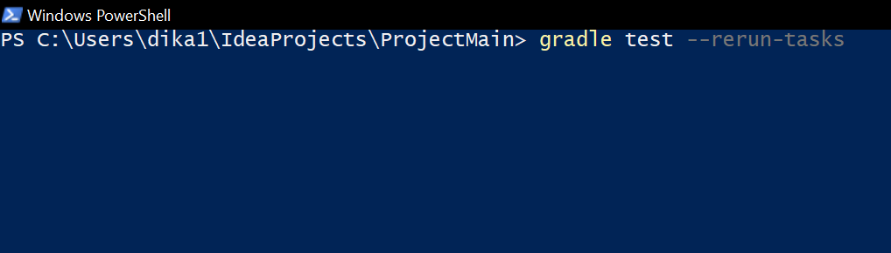
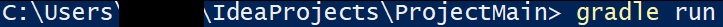
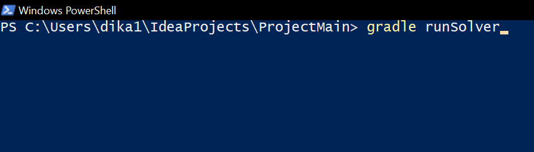
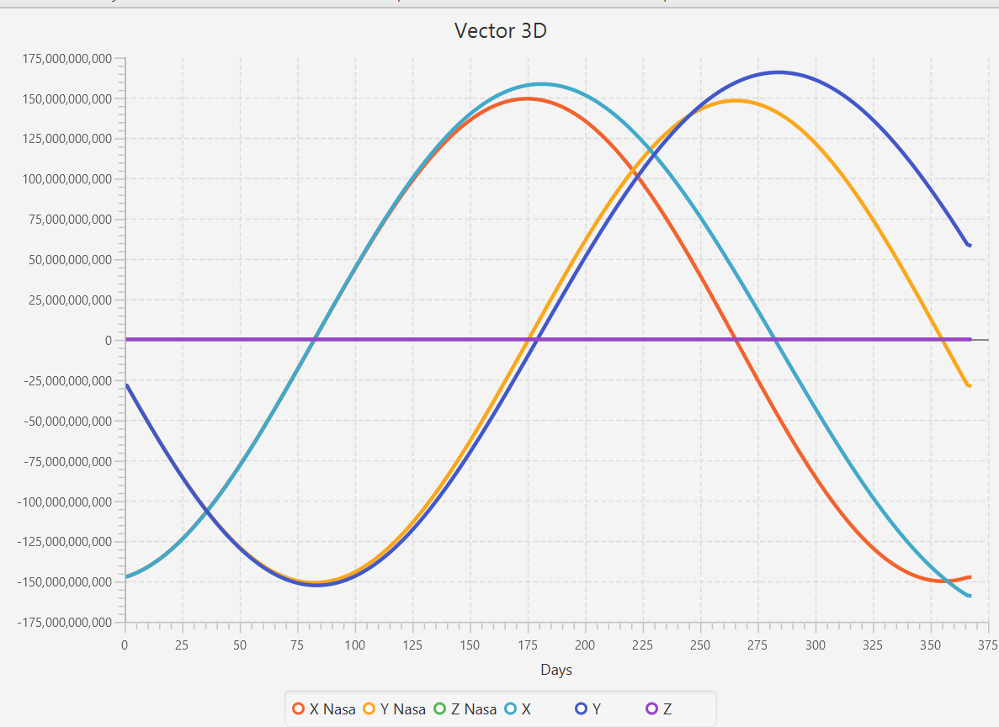
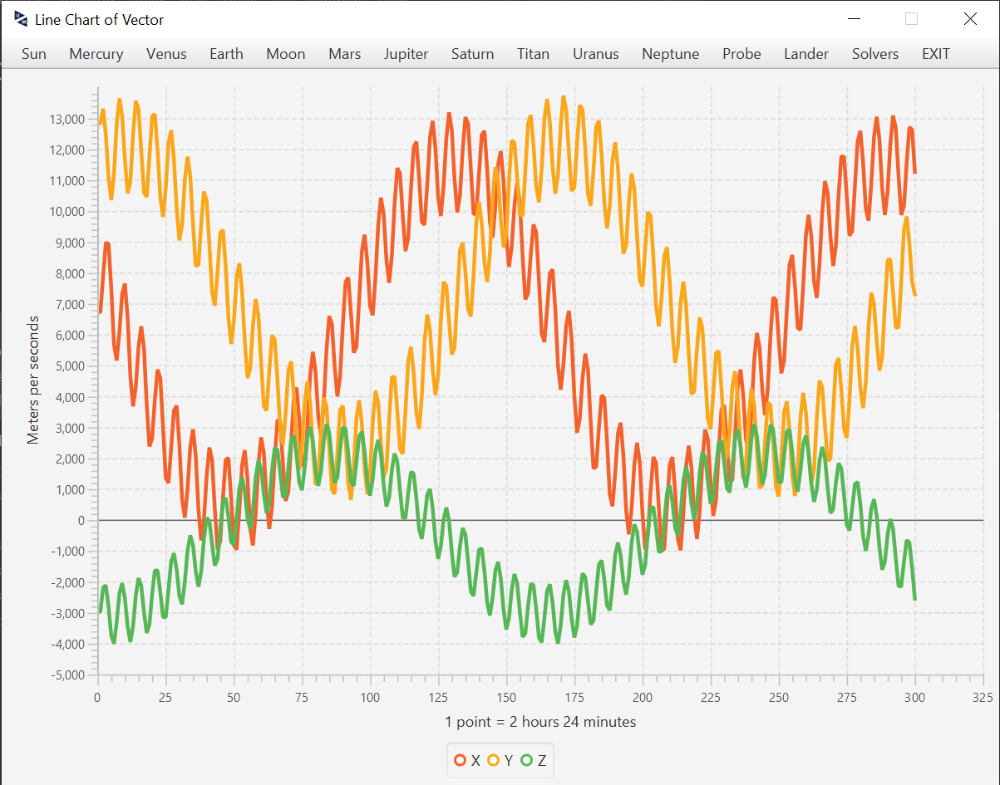
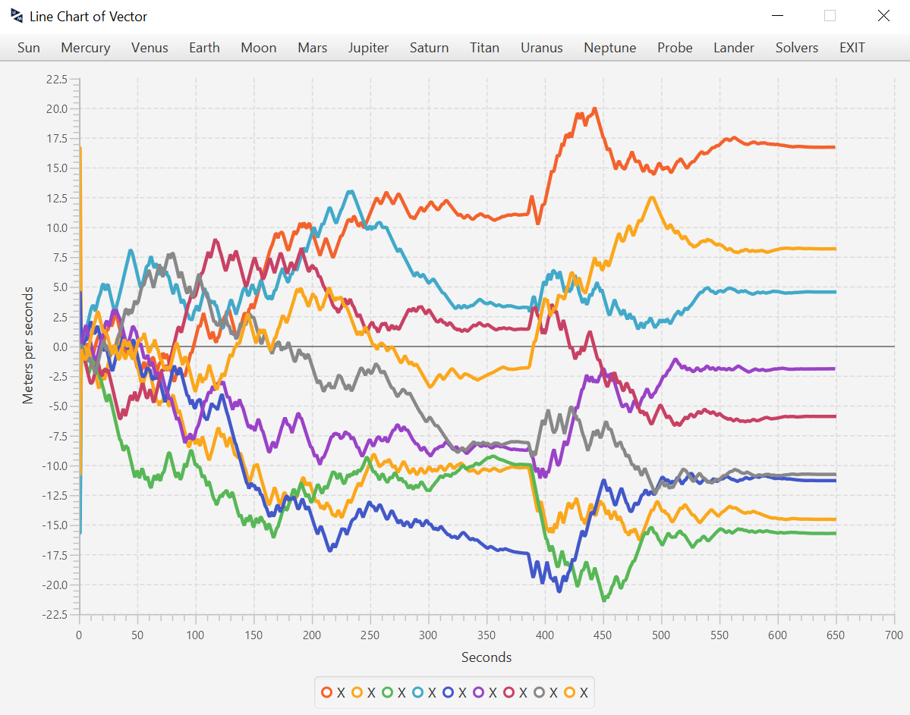

*#Project2_Group10*
   # The capabilities of our program
   ### 1. Representation of the solar system (GUI)  
   To represent the solar system, we use coordinates that we get using solvers and then scale them to allow a better visualization on the screen. 
          **HOT-KEYS** for the solar system representation:   
   - W - Zoom in  
   - S - Zoom out  
   - D - Camera to the right  
   - A - Camera to the left  
   - R - Camera to the top  
   - F - Camera to the bottom  
   
   ### 2. Calculate the trajectory of the probe and planets
   We have two options: 
       1) You can start the GUI and run solvers with our parameters.  
      2) You can start the console and run the program with your parameters  
    For calculation, we can use 4 solvers:   
   - Implicit Euler  
   - Symplectic Euler  
   - Velocity-Verlet (Leapfrog-Verlet implementation)  
   - 4th order Runge-Kutta  
   
   ### 3. Calculate the initial velocity of the probe 
   Our program calculates the optimal initial velocity to reach Titan.
   
   ### 4. Compare coordinates with NASA coordinates
   We can compare the coordinates of the probe and planets calculated by our program with the ones from NASA horizons. Then, the program can represent this comparison using  line charts.
   
   ### 5. JUnit testing
   We can test our program on the correctness. We implemented cases, which test our methods and formulas that we use. 
   
   ### 6. Experiments with solvers
   We can run our experiments calculation, where we can see the best and the worst step-size and their relative errors.
   
   
  # Instruction on how to use our program
  
  ### JUnit testing
   To test our program, run this command on the terminal inside the main directory (*You need to see "src" folder*):   
   ***gradle test***   
       
   If first command does not give the output, try this:   
   ***gradle test --rerun-tasks***   
       
   
  ### Graphic User Interface
   To run our GUI, run this command on the terminal inside the main directory (*You need to see "src" folder*):   
   ***gradle run***   
       
  
  ### Calculate the trajectory of the probe with your parameters 
   To Calculate the trajectory of the probe with your parameters, run this command on the terminal inside the main directory (*You need to see "src" folder*):   
   ***gradle runSolver***   
       
  
  ### Calculate the initial velocity of the probe 
   To Calculate the initial velocity of the probe, run this command on the terminal inside the main directory (*You need to see "src" folder*):   
   ***gradle runVelocity***   
       
   
   ### Experiments output
   To watch experiments with solvers, run this command on the terminal inside the main directory (*You need to see "src" folder*):   
   ***gradle runExperiments***   
       
   
   ### Fuel calculation
   To watch experiments with solvers, run this command on the terminal inside the main directory (*You need to see "src" folder*):   
   ***gradle fuel***   
       
   
   

  
  # Experiments with solvers and brute force
  ## Solvers
  In our experiments, we compare our coordinates and the coordiantes we got from NASA horizons system. We then represent this comparison using line charts. Also, we represent the trajectory of the probe, like that we can understand that solvers calculate correctly and we don't have 'anomalies' in the trajectory. Additionaly, we calculate the relative error of each solver, with different step sizes.   
  Parameters for calculation:   
  Initial position of the probe = x=4301000.0  y=-4692000.0  z=276000.0   
  Initial velocity of the probe = x=35760.650634765625  y=-48159.48486328125  z=-604.095458984375   
  Steap size = 1 day (This is not a good step size, but like that, we can see differents between solvers)   
  Final time = 1 year 6 hours (Average = 3 year and 1 leap year)   
  ### Implicit Euler
  **&emsp;&emsp;&emsp;&emsp;&emsp;&emsp;&emsp;&emsp; Earth &emsp;&emsp;&emsp;&emsp;&emsp;&emsp;&emsp;&emsp;&emsp;&emsp;&emsp;&emsp;&emsp;&emsp;&emsp;&emsp;&emsp; Titan &emsp;&emsp;&emsp;&emsp;&emsp;&emsp;&emsp;&emsp;&emsp;&emsp;&emsp;&emsp;&emsp;&emsp;&emsp;&emsp;&emsp;   ** 
   &emsp;    

|   | 1 day experiments | 1 year and 6 hours experiments |
| ------------- | ------------- | ------------- |
| The best step size  | 31 minutes  | 1 minutes  |
| Average relative error  | 0.0000129%  | 0.55544927% |
|Run time|55.0ms|6661.0ms|
||
|The worst step size|1 day|1 day|
|Average relative error|0.0150653%|152.91863146%|
|Run time|less than 0ms|2.0ms|

  ### Symplectic Euler
  **&emsp;&emsp;&emsp;&emsp;&emsp;&emsp;&emsp;&emsp; Earth &emsp;&emsp;&emsp;&emsp;&emsp;&emsp;&emsp;&emsp;&emsp;&emsp;&emsp;&emsp;&emsp;&emsp;&emsp;&emsp;&emsp; Titan &emsp;&emsp;&emsp;&emsp;&emsp;&emsp;&emsp;&emsp;&emsp;&emsp;&emsp;&emsp;&emsp;&emsp;&emsp;&emsp;&emsp;   ** 
   &emsp;     
  
|   | 1 day experiments | 1 year and 6 hours experiments |
| ------------- | ------------- | ------------- |
| The best step size  | 1 minutes  | 1 minutes  |
| Average relative error  | 0.0000107%  | 0.02931843%  |
|Run time|78.0ms|10218.0ms|
||
|The worst step size|1 day|1 day|
|Average relative error|0.0110984%|1.23843228%|
|Run time|less than 0ms|22.0ms|

  ### Verlet-Velocity (Leap-frog integration)
  **&emsp;&emsp;&emsp;&emsp;&emsp;&emsp;&emsp;&emsp; Earth &emsp;&emsp;&emsp;&emsp;&emsp;&emsp;&emsp;&emsp;&emsp;&emsp;&emsp;&emsp;&emsp;&emsp;&emsp;&emsp;&emsp; Titan &emsp;&emsp;&emsp;&emsp;&emsp;&emsp;&emsp;&emsp;&emsp;&emsp;&emsp;&emsp;&emsp;&emsp;&emsp;&emsp;&emsp;   ** 
   &emsp;    

|   | 1 day experiments | 1 year and 6 hours experiments |
| ------------- | ------------- | ------------- |
| The best step size  | 30 minutes  | 1 minutes  |
| Average relative error  | 0.000001%  | 0.02828209%  |
|Run time|less than 0ms|10218.0ms|
||
|The worst step size|1 day|1 day|
|Average relative error|0.0034469%|0.5745253%|
|Run time|less than 0ms|11.0ms|

  ### 4th order Runge-Kutta
  **&emsp;&emsp;&emsp;&emsp;&emsp;&emsp;&emsp;&emsp; Earth &emsp;&emsp;&emsp;&emsp;&emsp;&emsp;&emsp;&emsp;&emsp;&emsp;&emsp;&emsp;&emsp;&emsp;&emsp;&emsp;&emsp; Titan &emsp;&emsp;&emsp;&emsp;&emsp;&emsp;&emsp;&emsp;&emsp;&emsp;&emsp;&emsp;&emsp;&emsp;&emsp;&emsp;&emsp;   ** 
   &emsp;    

|   | 1 day experiments | 1 year and 6 hours experiments |
| ------------- | ------------- | ------------- |
| The best step size  | 1 minutes  | 1 minutes  |
| Average relative error  | 0.0000043%  | 0.55327744%  |
|Run time|84.0ms|23754.0ms|
||
|The worst step size|1 day|1 day|
|Average relative error|0.0066612%|107.23832829%|
|Run time|less than 0ms|21.0ms|

# A Titanic Space Odyssey
## Mission to Titan
Reach the Titan after 713 day 18 hours 33 minutes 20 seconds. Images below illustrate the trajectory of the probe Position and Velocity   
 &emsp;  
## Stay on the orbit of Titan
Stay on the orbit of Titan 30 days. Images below illustrate the trajectory of the probe Position and Velocity   
 &emsp;  
## Return mission to Earth
Reach the Earth after 713 day 18 hours 31 minutes 56 seconds. Images below illustrate the trajectory of the probe Position and Velocity   
 &emsp;  

# Landing Mission on Titan
## Line chart representation
Images below illustrate the trajectory of the lander Position / Velocity / Angle / Angle Velocity   
 &emsp;    
 &emsp;  
## Stochastic Wind
Images below illustrate the trajectory of the lander under influence stochastic wind Position and Velocity   
 &emsp;    
 &emsp;    
 &emsp;    
