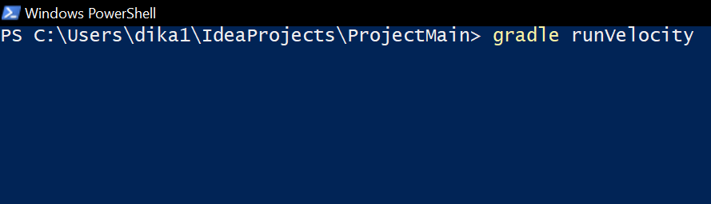

*#Project2_Group10*
   # The capabilities of our program
   ### 1. Representation of the solar system (GUI)  
   To represent the solar system, we use coordinates that we get using solvers and then scale them to allow a better visualization on the screen. 
          **HOT-KEYS** for the solar system representation:   
   - W - Zoom in  
   - S - Zoom out  
   - D - Camera to the right  
   - A - Camera to the left  
   - R - Camera to the top  
   - F - Camera to the bottom  
   
   ### 2. Calculate the trajectory of the probe and planets
   We have two options: 
       1) You can start the GUI and run solvers with our parameters.  
      2) You can start the console and run the program with your parameters  
    For calculation, we can use 4 solvers:   
   - Implicit Euler  
   - Symplectic Euler  
   - Velocity-Verlet (Leapfrog-Verlet implementation)  
   - 4th order Runge-Kutta  
   
   ### 3. Calculate the initial velocity of the probe 
   Our program calculates the optimal initial velocity to reach Titan.
   
   ### 4. Compare coordinates with NASA coordinates
   We can compare the coordinates of the probe and planets calculated by our program with the ones from NASA horizons. Then, the program can represent this comparison using  line charts.
   
   
  # Instruction on how to use our program
  
  ### JUnit testing
   To test our program, run this command on the terminal inside the main directory (*You need to see "src" folder*):   
   ***gradle test***   
       
   If first command does not give the output, try this:   
   ***gradle test --rerun-tasks***   
       
   
  ### Graphic User Interface
   To run our GUI, run this command on the terminal inside the main directory (*You need to see "src" folder*):   
   ***gradle run***   
       
  
  ### Calculate the trajectory of the probe with your parameters 
   To Calculate the trajectory of the probe with your parameters, run this command on the terminal inside the main directory (*You need to see "src" folder*):   
   ***gradle runSolver***   
       
  
  ### Calculate the initial velocity of the probe 
   To Calculate the initial velocity of the probe, run this command on the terminal inside the main directory (*You need to see "src" folder*):   
   ***gradle runVelocity***   
       
   
   ### Experiments output
   To watch experiments with solvers, run this command on the terminal inside the main directory (*You need to see "src" folder*):   
   ***gradle runExperiments***   
       
   
   

  
  # Experiments with solvers and brute force
